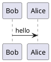

# write_in_vnote


Inline $e=mc^2$ oke




```puml
rectangle Vnote {
User --> (Manage Note)
User --> (Take Note)
User --> (Search Note)
User --> (Jump Note)
```

```flowchart
st=>start: Start:>http://www.google.com[blank]
e=>end:>http://www.google.com
op1=>operation: My Operation
sub1=>subroutine: My Subroutine
cond=>condition: Yes
or No?:>http://www.google.com
io=>inputoutput: catch something...

st->op1->cond
cond(yes)->io->e
cond(no)->sub1(right)->op1
```


